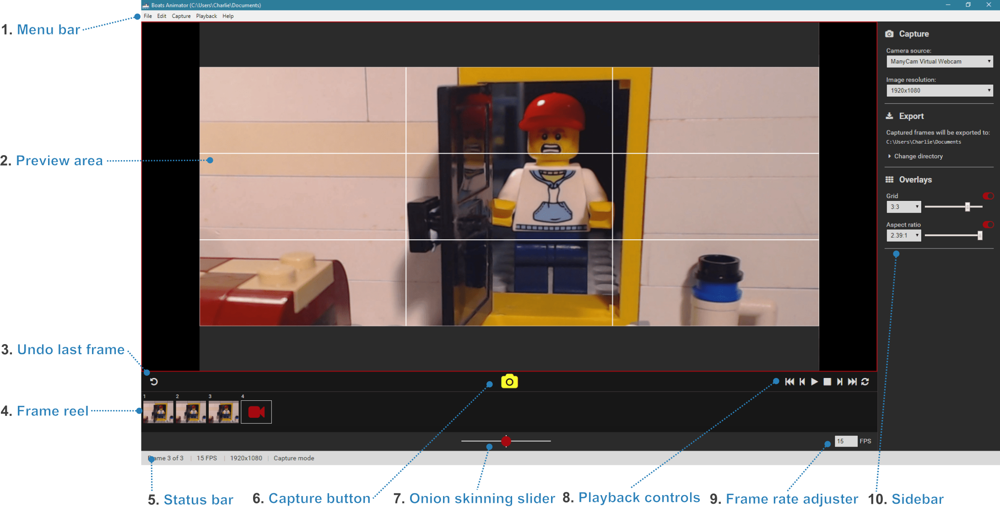
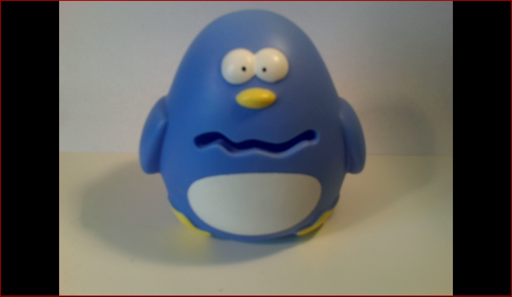

# Main window

[TOC]

## Menu bar

The menu bar contains an assortment of options both to do with the current project and the program in general.

### File menu
* **New project:** this feature has not been implemented yet.
* **Open project:** this feature has not been implemented yet.
* **Main menu:** select this to return to the [launcher window](launcher-window.md).
* **Exit:** select this to close the program.

### Edit menu
* **Delete last frame:** select this to activate the [undo last frame](#undo-last-frame) button.

### Capture menu
* **Capture frame:** select this to activate the [capture button](#capture-button).
* **Play capture sounds:** this toggles whether a sound plays when a frame is captured.
* **Change capture destination:** select this to change the folder Boats Animator exports captured frames to.

### Playback menu
* **Loop playback:** toggle if playback should continue from the first frame captured when the last frame captured is reached.
* **Display first frame:** this previews the first frame captured.
* **Display last frame:** this previews the last frame captured.

### Help menu
* **Documentation:** select this to view Boats Animator's [documentation](http://boatsanimator.readthedocs.org/) (the website you are currently on!).
* **Give feedback:** select this to load the [issues page](https://github.com/charlielee/boats-animator/issues) of Boats Animator's GitHub repository.
* **About Boats Animator:** select this to load the [about window](about-window).

## Preview area

The preview area shows a live feed of the selected camera in [capture mode](#capture-mode) and is where frames are played back in [playback mode](#playback-mode). In capture mode a red border is displayed around the preview area.

## Undo last frame
**Shortcut: `<Ctrl+Z>`**

Select this to remove the last frame in the frame reel and delete it permanently from the hard-drive. After selecting this a confirm dialogue with "Are you sure you want to delete the last frame captured?" is displayed.

## Frame reel

The frame reel area displays thumbnails of all of the frames that have been captured. To preview a particular frame in the preview area simply select it from the frame reel. The current frame being previewed will have a white outline around it in the frame reel and playback will begin from this frame.

### Live-view button
On the far right of the frame reel is the live-view button. After previewing captured frames, select this to return to [capture mode](#capture-mode). In capture mode this button has a white outline around it.

## Status bar

The status bar contains useful information about the current project.

### Current frame
`Frame x of y`

This is an indicator of what is currently being displayed in the preview area. When in capture mode `x` is equal to one more than the number of frames currently captured. The logic here is: "once this picture is taken it will become the `x`th frame captured."

### Current FPS
`xx FPS`

This is the frame rate that will be used to playback frames. The playback frame rate can be adjusted using the [frame rate adjuster](#frame-rate-adjuster).

### Current resolution
`0000x0000` or `No camera selected`

This is the current capture resolution that has been selected. `No camera selected` is displayed when a capture device is yet to be selected in the sidebar.

### Current mode
`x mode`

This is the current mode Boats Animator is in.

#### Capture mode
This is when a live-feed of the selected camera is displayed in the preview area. Capture mode is accessed by selecting the [live-view button](#live-view-button).

#### Playback mode
This is when a captured frame is displayed in the preview area. Preview mode can be accessed either by selecting a captured frame from the [frame reel](#frame-reel) or by selecting the play button.

## Capture button
**Shortcut: `<Enter>`**

Select this button to capture a new frame from the live-feed that is visible in [capture mode](#capture-mode).

## Onion skinning slider

This is used to set the amount of [onion skinning](https://en.wikipedia.org/wiki/Onion_skinning) that is displayed in the preview area in [capture mode](#capture-mode). Move the slider to the right of center to increase the opacity of the last frame captured. At present, moving the slider to the left will have the same effect. To turn off onion skinning move the slider back to the center.

## Playback controls

These buttons affect the playback of captured frames in the [preview area](#preview-area).

### First frame
This previews the first frame captured.

### Previous frame
This previews one frame to the left in the [frame reel](#frame-reel) of the current frame being displayed.

### Playback / pause frames
When this is selected playback will begin from the first frame captured or resume from the current frame being previewed if in [playback mode](#playback-mode).

The playback frames button switches to a pause button during playback. Selecting it pauses playback at the current frame being previewed.

### Stop playback
Select this to stop playback and jump to the last frame captured.

### Next frame
This previews one frame to the right in the [frame reel](#frame-reel) of the current frame being displayed.

### Last frame
This previews the last frame captured.

### Loop playback
Select this to toggle if playback should continue from the first frame captured when the last frame captured is reached.

## Frame rate adjuster

This is used to set the number of frames per second to be displayed during playback. Whole numbers between 1 and 60 are accepted.

## Sidebar

The sidebar contains options that are generally not changed very often during animating.

### Capture

#### Camera source
This is used to select the device to capture frames with. The list will automatically update if a device is plugged in or unplugged.

!!! note "Note"
    Please note that Boats Animator currently only supports webcams and other similar USB devices. D-SLR support is not expected anytime soon.

#### Image resolution
This is used to select the resolution to capture frames at. The list is updated when the **camera source** is changed, to only show resolutions that are supported by the given device.

If you select a resolution, switch to a different device, and switch back again, the last resolution selected will be remembered.

### Export

#### Change directory
Select this to change the folder Boats Animator exports captured frames to.

!!! warning "Warning"
    Please be aware that Boats Animator will overwrite the existing frames in this directory if it has been used for a project before. This behaviour will be changed in a future version.

### Overlays

#### Grid
This displays a grid over the preview area in capture mode when the toggle button is selected. When enabled, the grid can be configured via a drop-menu and the opacity slider.

#### Aspect ratio
This displays a mask of the selected aspect ratio over the preview area when the toggle button is selected. When enabled, the mask can be configured via a drop-menu and the opacity slider.